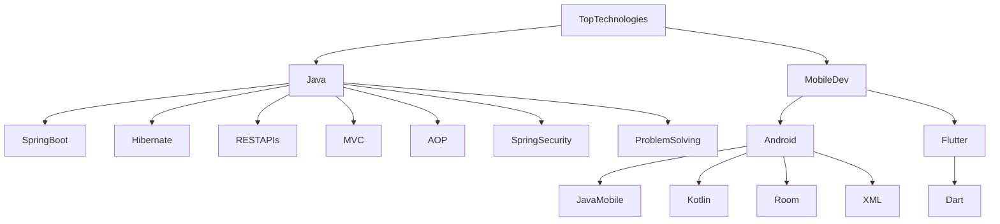

# Hi,I'm MohamedTarek👋
## A software engineer with a great ambition and a passion for learning
> From Egypt,Cairo

📫 To mail me :- mohamedana17327@gmail.com

📧 How to communicate with me:
[LinkedIn](https://www.linkedin.com/in/mohamed-tarek-958ab5198/) or [Facebook](https://www.facebook.com/profile.php?id=100006295150852)

🗃️ Know about my experience [CV](https://drive.google.com/file/d/1nO-glKWbe9kLbKA4xoBE-6D05BDAb6N3/view?usp=sharing)

My top languages

| Rank | Languages |
|-----:|-----------|
|     1| Java|
|     2| Dart    |
|     3| C++       |
|     4| Kotlin|
|     5| mySQL|

<h3 align="left">Languages and Tools:</h3>

             

